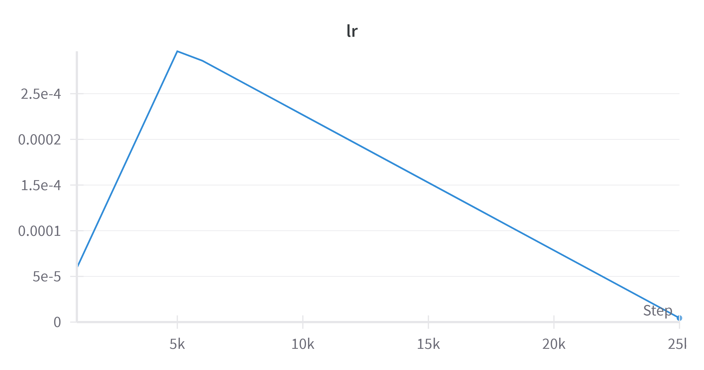

## Lab2.基于GPT2的程序生成

#### **一、系统设计**

###### 1. 模型基础架构

>主要模型基于 `DistilGPT-2` 架构，是一个生成式的语言模型。这个模型由 `up_model` 表示，通过 `GPT2LMHeadModel.from_pretrained(args.model_path)` 加载预训练的 `DistilGPT-2` 模型。这个基础模型负责理解上下文并生成文本。

```python
self.up_model = GPT2LMHeadModel.from_pretrained(args.model_path)
```

模型设计中引入了下游任务头部 (`down_layer`)，用于适应特定的下游任务。在模型中，如果没有提供下游任务头部 (`down_layer == None`)，则使用了一个占位符 `EmptyHeads()`。

```python
if down_layer == None:
    down_layer = EmptyHeads()
self.down_layer = down_layer
```

通过 `torch.nn.Sequential` 将上游模型和下游任务头部整合在一起，形成一个端到端的模型。

```python
self.model = torch.nn.Sequential(self.up_model, self.down_layer)
```


###### 2.训练方法

>训练过程包括了数据加载、模型定义、损失计算、梯度下降、模型保存、学习率调度、评估等基本步骤，使用了一些高级技术如梯度累积和混合精度训练。

**模型定义（model.py）**：

- 使用了 `DistilGPT-2` 模型，该模型是 GPT-2 模型的轻量化版本。
- 在模型定义中，通过 `EmptyHeads` 类实现了一个空的下游任务头部

**训练数据加载和预处理（trainer.py）**：

- 通过 `DataLoader` 加载训练数据。
- 使用自定义的 `CollateFunction` 类进行数据批处理。

**训练过程（trainer.py）**：

- 在 `_train_epoch` 方法中，循环遍历训练数据，计算损失并执行梯度下降。
- 使用梯度累积（gradient accumulation）来积累梯度，并在积累到一定步数时进行反向传播和参数更新。
- 使用梯度裁剪来防止梯度爆炸。
- 支持混合精度训练，即使用 Apex 库的 AMP（Automatic Mixed Precision）功能，提高训练速度。

**模型保存和加载（trainer.py）**：

- 支持从检查点中加载模型以进行继续训练。
- 定期保存模型的检查点，并记录评估结果。

**学习率调度和优化器（trainer.py）**：

- 使用学习率调度器（scheduler）进行学习率的调整，支持不同的调度策略，如常数学习率、线性学习率衰减、余弦退火等。
- 使用 `AdamW` 优化器，并支持权重衰减。

**评估和日志记录（trainer.py）**：

- 在训练过程中定期进行评估，记录并输出评估结果。
- 使用 `TensorBoard` 和 `WandB`记录训练过程中的指标。

**整体训练流程（train.py）**：

- 创建模型、数据集、评估器等实例。
- 初始化 Trainer，并执行训练流程。


#### 二、实验结果

###### 1.训练结果以及loss曲线

>`loss_train`：0.2811
>
>`eval_perplexity_dev`：1.193
>
>`loss_dev`：0.1768
>
>`best_score_for_perplexity`：-1.193




###### 2.实际效果

python:


java:


###### 3.调参实验

> 虽然没有要求，但是因为运行了很多次才找到合适的参数，因此还是展示一下

自变量：学习率`lr`

因变量：损失`loss`、`best_score_for_perplexity`


我们可以发现，随着`lr`的增大，`loss`减少，`best_score_for_perplexity`增大，这是因为我们初始的`lr`设置的比较小，为e-6级别，增大学习率可能会加速模型的收敛，导致训练过程更快地达到最优解。

值得一提的是，由于我是租的服务器，计算资源很有限，因此在现在的学习率上继续增大`lr`，得到的效果很差，因此直接`Ctrl+c`终止了运行，所以这里为了美观而不展示。

###### 4.实验效果分析以及发现的一些问题：

a.每次epoch开始的loss_train都会突然下降：这是因为代码中使用了学习率调度器 (`scheduler`)，采用了在训练过程中调整学习率的策略。`warmuplinear` 策略会在 warmup 阶段线性增加学习率，然后进行线性减小。

b.生成代码效果并不是很好：最终得到的loss只有0.28，但是能够生成一定数量的代码，但是同时也会犯很多错误。这可能是因为在训练的时候，我比起原作者还是使用了更少的epoch和更短的训练时间，我两个小时不到就训练完成了模型，同时这可能和`distilGpt2`本身的语言模型有关，可能模型的能力不够，考虑到gpt3.5也经常会生成一些错误代码，这也有可能是模型本身的问题。

#### 三、创新点和改进的地方

###### 1.使用了混合精度训练模型：

```python
if fp16:
            try:
                from apex import amp
            except ImportError:
                raise ImportError("Please install apex from https://www.github.com/nvidia/apex to use fp16 training.")

            model, optimizer = amp.initialize(self.model, self._optimizer, opt_level=fp16_opt_level)
            self.model = model
            self._optimizer = optimizer
```

在这个地方，将fp16设置为true，使用了apex的apm库进行混合精度训练。

我自己还尝试了使用torch1.6以后自带的`torch.cuda.amp`库进行训练，发现效果与apex的amp没有什么差别。


###### 2.重写了interact.py：

**防止模型关注无关部分：** 

注意力遮罩可以确保模型在生成时只关注输入序列的有效部分，而不会受到填充标记的干扰。这有助于生成更有意义、更准确的文本。

```python
attention_mask = torch.ones(input_ids.shape, device=input_ids.device)
```

#####  采样允许模型：

采样允许模型在生成的过程中引入随机性，这样可以得到更加多样化的输出。相对于贪婪生成方式，采样可以导致不同的单词和结构被选择。通过调整温度（temperature）参数，可以控制生成时的随机性。

```python
do_sample=True,
temperature=args.temperature,
```


###### 3.与当前科研课题结合来完善一部分数据集：

我目前正在进行一些java方面的污点流分析相关工作，因此我根据往年`CVE（Common Vulnerabilities and Exposures）`发现的安全漏洞代码并给出的安全代码，将一部分解决的CVE的代码添加到了java的数据库当中，以此来增强生成java代码的安全性。


###### 4.自定义的参数设置：

通过多次调参实验，保证内存不会溢出的同时进行了合理的参数调整，使得loss尽可能的小，但同时也防止了过拟合的存在。

```python
parser = argparse.ArgumentParser(description='Hyper params')
    parser.add_argument('--model_select', type=str, default="distilgpt2",
                        help='model select from distilgpt2, gpt2_medium, gpt2, or gpt2_large')
    parser.add_argument('--dataset_name', type=str, default="source_code",
                        help='dataset name whatever name you put into the ./dataset directory (by default: source_code)')
    parser.add_argument('--per_gpu_train_batch_size', type=int, default=8,
                        help='input batch size for training')
    parser.add_argument('--dev_batch_size', type=int, default=8,
                        help='input batch size for development')
    parser.add_argument('--num_epochs_train', type=int, default=4,
                        help='number of epochs to train')
    parser.add_argument('--max_seq_length', type=int, default=256,
                        help='maximum sequence length of samples in a batch for training')
    parser.add_argument('--lr', type=float, default=3e-4,
                        help='learning rate')
    parser.add_argument('--warmup_ratio', type=float, default=0.2,
                        help='warmup_ratio')
    parser.add_argument('--early_stop', type=int, default=20,
                        help='early_stop')
    parser.add_argument('--scheduler', type=str, default="warmuplinear",
                        help='scheduler')
    parser.add_argument('--seed', type=int, default=122,
                        help='random seed')
    parser.add_argument('--accumulation_steps', type=int, default=4,
                        help='accumulation steps if you want large batch size but can not fit in the memory allowed')
    parser.add_argument('--n_gpu', type=int, default=1,
                        help='number of gpu for training')
    parser.add_argument('--visiable_device', type=str, default="0",
                        help='visiable gpus for training, should be consistent with n_gpu')
    parser.add_argument('--evaluation_steps', type=int, default=1000,
                        help='evaluation_steps')
    parser.add_argument('--wandb_project_name', type=str, default="code_generate",
                        help='project name for wandb')
    parser.add_argument(
        "--restore_training", action="store_true", help="restore training if a saved checkopint exists"
    )
    parser.add_argument(
        "--with_wandb", action="store_true", help="Train with wandb tracking."
    )
    parser.add_argument(
        "--wandb_run_name", type=str, default="default_run", help="Run name for WandB."
    )
```


#### 四、参考文献

1.[wangcongcong123/auto_coding: A basic and simple tool for code auto completion (github.com)](https://github.com/wangcongcong123/auto_coding)

2.[distilgpt2 · Hugging Face](https://huggingface.co/distilgpt2)
