# Lab3.基于CNN-LSTM的视频分类

### 一、代码框架

> 本次实现是基于[https://www.kaggle.com/code/nguyenmanhcuongg/pytorch-video-classification-with-conv2d-lstm]()以及给出的scratch.py，如然后再对代码进行了重构实现的，分为自实现cnn，googlenet预训练模型和resnet预训练模型三部分，使用matplotlib进行作图。

##### 1.预训练CNN(使用Resnet101)

1. **VideoDataset 类** ：继承自 `torch.utils.data.Dataset`，用于加载视频数据集。在 `__init__` 方法中，通过传入数据目录、类别数、视频帧数、变换等参数，初始化数据集。`__getitem__` 方法用于获取数据集中的样本，包括视频帧和类别标签。
2. **ClassificationModel 类** ：继承自 `torch.nn.Module`，定义了视频分类模型。在 `__init__` 方法中，使用 timm 库创建了指定主干网络（默认为 ResNet101）的特征提取部分，接着使用一个LSTM层进行时间序列建模，并通过全连接层输出分类结果。在 `forward` 方法中，将输入的视频帧经过主干网络、自适应平均池化、LSTM层等层次处理，最终输出分类结果。
3. **train 函数** ：用于模型的训练。接收模型、训练数据、损失函数、优化器、训练周期等参数，通过迭代训练来更新模型参数。支持在训练过程中进行验证，并保存训练历史。还可以设置学习率调度器。
4. **evaluate 函数** ：用于模型的评估。接收模型、验证数据、设备、损失函数等参数，计算模型在验证数据上的损失和准确率。
5. **visualize_history 函数** ：用于可视化训练历史，包括训练和验证的准确率和损失。
6. **使用示例** ：在 `if __name__ == '__main__':` 部分，定义了数据预处理的变换、创建了数据集、划分了训练和测试集，初始化了模型、损失函数和优化器，并调用 `train` 函数进行训练，最后通过 `visualize_history` 函数可视化训练历史。

使用了提供的data_scratch.py与示例代码结合，同时在训练循环中，在循环外部使用 `iter`函数创建一个数据加载器的迭代器，然后在循环中使用 `next`函数来获取下一批数据。

```python
iterator = iter(train_loader)

for epoch in range(epochs):
    for batch_idx in range(len(train_loader)):
        try:
            # 获取下一批数据
            img_batch, label_batch = next(iterator)
        except StopIteration:
            # 如果数据迭代结束，重新创建迭代器
            iterator = iter(train_loader)
            img_batch, label_batch = next(iterator)
```

##### 2.自行定义的普通CNN

1. **卷积层的定义** ：

* 第一个卷积层 (`self.conv1`)：输入通道数为3（RGB图像），输出通道数为64，卷积核大小为3x3，步长为1，填充为1。
* 第二个卷积层 (`self.conv2`)：输入通道数为64，输出通道数为128，卷积核大小为3x3，步长为1，填充为1。
* 第三个卷积层 (`self.conv3`)：输入通道数为128，输出通道数为256，卷积核大小为3x3，步长为1，填充为1。

2. **激活函数和池化层的定义** ：

* 每个卷积层后都跟有ReLU激活函数 (`self.relu1`, `self.relu2`, `self.relu3`)。
* 每个卷积层后都跟有最大池化层 (`self.pool1`, `self.pool2`, `self.pool3`)，池化核大小为2x2，步长为2。

3. **全连接层的修改** ：

* 修改了最后的全连接层 (`self.fc1`)，输入大小为256x8x8（由于三个池化层的作用），输出大小为512。
* 使用ReLU激活函数 (`self.relu4`)。

4. **前向传播 (`forward` 方法)** ：

* 输入张量的大小为 `(batch_size, num_frames, 3, 64, 64)`，其中 `num_frames` 表示视频帧的数量。
* 将输入张量展平为 `(batch_size * num_frames, 3, 64, 64)`，然后通过第一个卷积层、ReLU激活函数和最大池化层进行处理，输出大小为 `(batch_size * num_frames, 64, 32, 32)`。
* 通过第二个和第三个卷积层，每层都包含ReLU激活函数和最大池化层，逐步减小特征图的大小。
* 展平卷积层的输出，通过修改的全连接层，并再次使用ReLU激活函数。
* 最后，重新调整张量的形状以匹配输出要求，添加了额外的维度 `(batch_size * num_frames, 512, 1, 1)`。

```python
# 自定义的SimpleCNN
class SimpleCNN(nn.Module):
    def __init__(self, num_classes):
        super(SimpleCNN, self).__init__()

        # 第一个卷积层
        self.conv1 = nn.Conv2d(in_channels=3, out_channels=64, kernel_size=3, stride=1, padding=1)
        self.relu1 = nn.ReLU()
        self.pool1 = nn.MaxPool2d(kernel_size=2, stride=2)

        # 第二个卷积层
        self.conv2 = nn.Conv2d(in_channels=64, out_channels=128, kernel_size=3, stride=1, padding=1)
        self.relu2 = nn.ReLU()
        self.pool2 = nn.MaxPool2d(kernel_size=2, stride=2)

        # 第三个卷积层
        self.conv3 = nn.Conv2d(in_channels=128, out_channels=256, kernel_size=3, stride=1, padding=1)
        self.relu3 = nn.ReLU()
        self.pool3 = nn.MaxPool2d(kernel_size=2, stride=2)

        # 修改全连接层
        self.fc1 = nn.Linear(256 * 8 * 8, 512)  # 注意修改这里的输入大小
        self.relu4 = nn.ReLU()

    def forward(self, x):
        # 输入大小：(batch_size, num_frames, 3, 64, 64)
        batch_size, num_frames, _, _ = x.shape
        x = x.view(-1, 3, 64, 64)  # 展平 num_frames
        x = self.pool1(self.relu1(self.conv1(x)))
        # 输出大小：(batch_size * num_frames, 64, 32, 32)

        x = self.pool2(self.relu2(self.conv2(x)))
        # 输出大小：(batch_size * num_frames, 128, 16, 16)

        x = self.pool3(self.relu3(self.conv3(x)))
        # 输出大小：(batch_size * num_frames, 256, 8, 8)

        x = x.view(batch_size, num_frames, -1)  # 恢复 num_frames
        x = x.view(-1, 256 * 8 * 8)  # 展平
        x = self.relu4(self.fc1(x))
        # 输出大小：(batch_size * num_frames, 512)

        x = x.view(batch_size, num_frames, -1)    # 恢复 num_frames
        x = x.view(-1, 512, 1, 1)  # 添加额外的维度 (batch_size * num_frames, 512, 1, 1)

        return x
```

##### 3.使用**GoogLeNet**预训练的CNN

> 由于课上提到了**GoogLeNet**，因此想去尝试一下使用**GoogLeNet会是什么样的结果。**

对 `ClassficationModel`类进行了修改，因为考虑到GoogLeNet的输入输出，GoogLeNet 版本在获取骨干网络输出后，通过 `AdaptiveAvgPool2d` 进行全局平均池化，同时通过 `torch.squeeze` 和 `torch.reshape` 操作将输出展平。具体代码如下：

```python
class ClassificationModel(nn.Module):
    def __init__(self, num_classes, hidden_size, num_lstm_layers=2):
        super(ClassificationModel, self).__init__()
        # 使用GoogLeNet作为骨干网络
        self.backbone = models.googlenet(pretrained=True)
        self.backbone.aux_logits = False

        # 假设GoogLeNet骨干网络的输出大小是1000
        self.lstm = nn.LSTM(1000, hidden_size, num_lstm_layers, batch_first=True)
        self.fc = nn.Linear(hidden_size, num_classes)

    def forward(self, x):
        # x: batch, num_frames, channels, height, width
        batch, num_frames, channels, height, width = x.shape

        # x: batch * num_frames, channels, height, width
        x = torch.reshape(x, (-1, *x.shape[2:]))

        # 获取GoogLeNet主分类器输出（logits）
        x = self.backbone(x)

        # 如果x的维度是2，则添加两个维度（1, 1）
        if x.dim() == 2:
            x = x.unsqueeze(2).unsqueeze(3)


        # 适应GoogLeNet的输出形状
        x = nn.AdaptiveAvgPool2d((1, 1))(x)

        # x: batch * num_frames, 1024
        x = torch.squeeze(x, dim=3).squeeze(dim=2)

        # x: batch, num_frames, 特征向量大小
        x = torch.reshape(x, (batch, num_frames, -1))

        # x: Tensor 大小 (batch_size, sequence_length, hidden_size)
        # h_n: 最后一层的隐藏状态, 大小 (num_layers, batch_size, hidden_size)
        # c_n: 最后一层的细胞状态, 大小 (num_layers, batch_size, hidden_size)
        x, (h_n, c_n) = self.lstm(x)

        x = x[:, -1, ...]  # 修正此处

        x = self.fc(x)

        return x
```

### 二、调参实验以及运行结果

> 使用的固定参数：
>
> ```
> epochs=50
> num_classes = 10
> batch_size = 4
> device = 'cuda' if torch.cuda.is_available() else 'cpu'
> num_frames = 20
> img_size = (120, 160)
> num_workers = 4
> hidden_size = 256
> ```

#### 1.使用resnet101的预训练模型

###### a.学习率lr与模型准确度val_acc的关系(`scheduler=torch.optim.lr_scheduler.StepLR(optimizer, step_size=20, gamma=0.2)`)

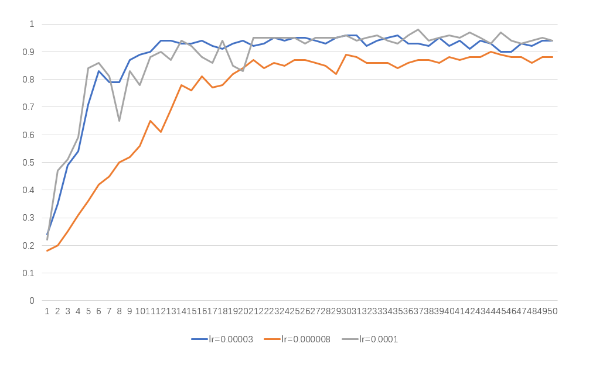

经上述分析，我们可以看到lr=0.0001的时候，波动十分大，说明学习率过大，到了20以后波动减小很可能是设置了 `scheduler=torch.optim.lr_scheduler.StepLR(optimizer, step_size=20, gamma=0.2)`的原因，使得学习率降低了；而lr=0.000008的时候，预测集的精确度明显较小，因此lr=0.00003的时候模型较为优秀。

lr=0.00003的时候的图像（由于上图考虑到50次epoch运行时间过长而且没有什么太大作用，这里使用25次epoch）

最终结果：Loss: 0.2655, Acc: 0.9625, Val_Loss: 0.2727, Val_Acc: 0.9500

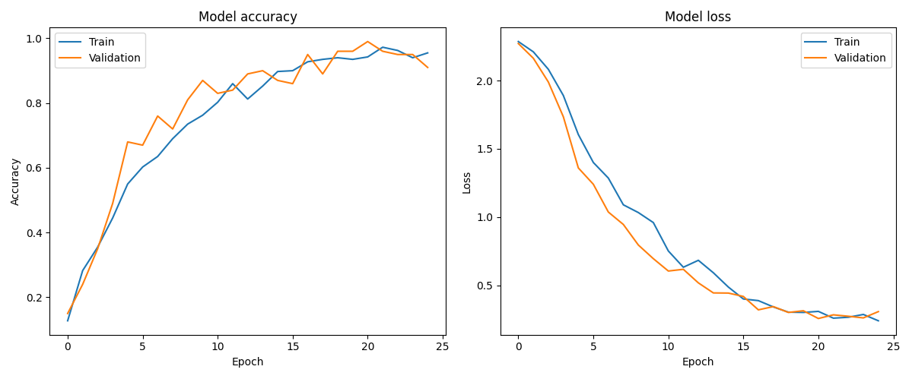

##### b.num_workers与val_acc的关系：

nums_workers = 4：

> 结果：Loss: 0.2655, Acc: 0.9625, Val_Loss: 0.2727, Val_Acc: 0.9500


num_workers = 8：

> 结果： Loss: 0.2433, Acc: 0.9775, Val Loss: 0.3659, Val Acc: 0.9000

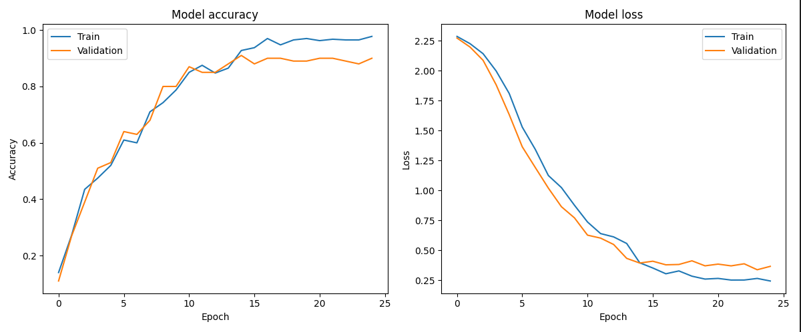

原因分析：num_workers增大，模型训练速度增快了很多，但是模型准确度下降了，猜测：在加载train_data的时候shuffle设置为true，每个 epoch 的数据顺序都会被打乱。这可能导致模型在每个 epoch 中看到的样本不同，num_workers太大导致模型过于混乱。

#### 2.使用自己的CNN进行训练的模型

##### a.学习率lr与模型准确度val_acc的关系(`scheduler=torch.optim.lr_scheduler.StepLR(optimizer, step_size=20, gamma=0.4)`)

lr=0.00008：

> 结果：Loss: 0.0149, Acc: 1.0000, Val Loss: 1.2315, Val Acc: 0.7100

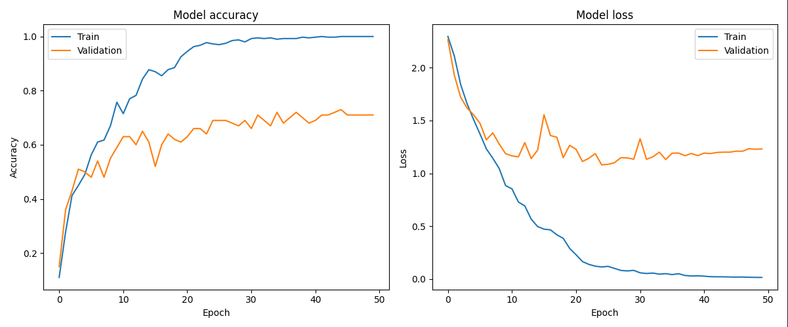

lr=0.0003：

> 结果：Loss: 0.3011, Acc: 0.9175, Val Loss: 1.4460, Val Acc: 0.5800

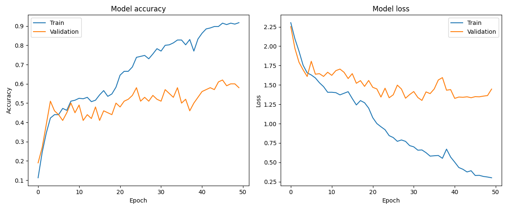

lr=0.000008：

> 结果： Loss: 0.3795, Acc: 0.9500, Val Loss: 1.0087, Val Acc: 0.6800

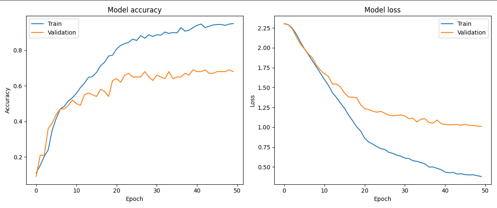

通过上面我们可以看出，lr在0.00008的时候生成的模型最稳定，同时val_acc最高，为71%；在0.0003的时候，val_acc和loss出现了较大的波动，可能因为学习率过于大，而在0.000008的时候，可能因为学习率小，导致学习的不充分，使得模型的准确度较低。

##### b.num_workers与val_acc的关系

num_workers=4：

> 结果：Loss: 0.0149, Acc: 1.0000, Val Loss: 1.2315, Val Acc: 0.7100


num_workers = 8：

> 结果：Loss: 0.4148, Acc: 0.9475, Val Loss: 1.0601, Val Acc: 0.6400

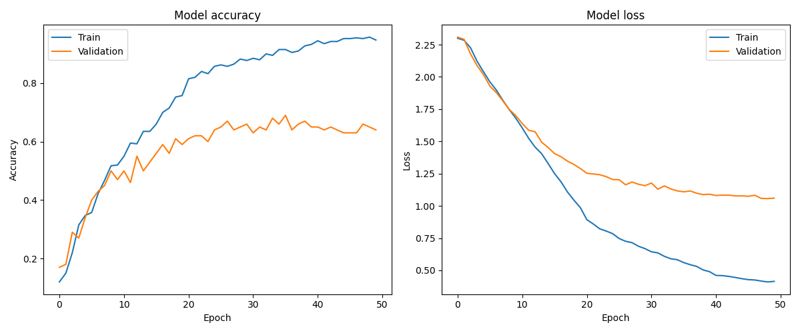

原因分析：与预训练的结果一样。num_workers增大，模型训练速度增快了很多，但是模型准确度下降了，猜测：在加载train_data的时候shuffle设置为true，每个 epoch 的数据顺序都会被打乱。这可能导致模型在每个 epoch 中看到的样本不同，num_workers太大导致模型过于混乱。

#### 3.使用GoogLeNet预训练的模型：（这里因为num_workers在前两个实验都一样，因此只进行了lr的实验）

lr=0.00003：

> 结果：Loss: 0.0446, Acc: 0.9950, Val Loss: 0.1727, Val Acc: 0.9700

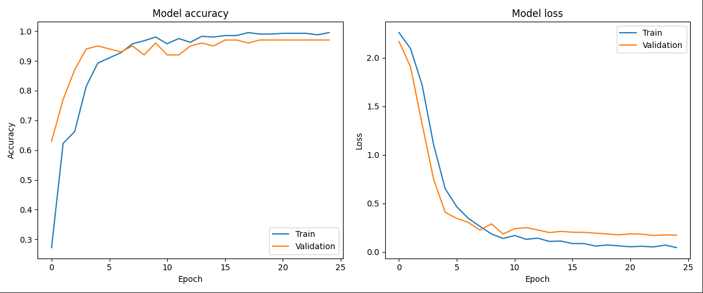

lr=0.000003：

> 结果： Loss: 1.9656, Acc: 0.5900, Val Loss: 1.9289, Val Acc: 0.6900

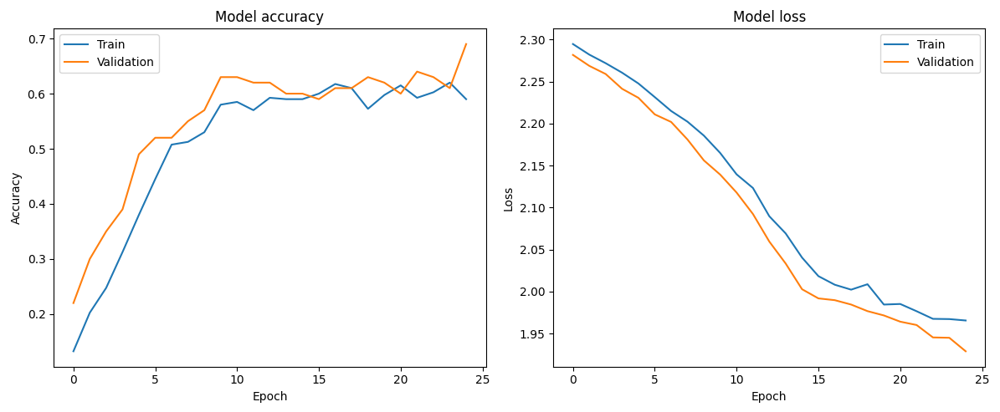

lr=0.0003：

> 结果： Loss: 0.0233, Acc: 0.9925, Val Loss: 0.4780, Val Acc: 0.9000

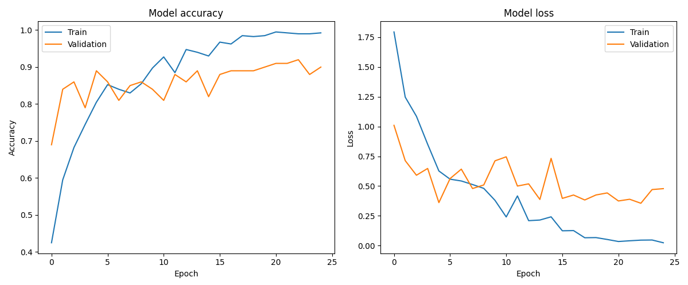

lr在0.00003的时候获得最好的效率，而过高在精度降低的同时，模型也不稳定，过低的时候，模型训练不充分，精度很低。

### 三、总结

###### 1.自训练的CNN是效果最差的，只有71%的精度，而GoogLeNet的精度最好，稳定在97%，Resnet101在95%.

原因分析：我的CNN使用了三层，而我去看了Resnet101实际上只用了一层，因此可能是我的模型过于复杂导致反而处理的不是很好。

而两种预训练模型的差距原因可能如下：

GoogLeNet 使用了一种被称为 Inception 的模块，其中包含多个不同大小的卷积核，这样可以在不同尺度上提取特征。这种架构的设计可以更好地捕获图像中的不同尺度和层次的特征。而 ResNet 使用了残差连接，允许网络更深，并且有助于解决训练深度网络时的梯度消失问题。

GoogLeNet 在一定程度上相对较深，但参数量相对较小，这使得它更容易训练，并且在资源有限的情况下可能表现更好。ResNet 则更深，拥有更多的参数，可能需要更大的数据集和更多的计算资源来训练。我们这里的数据集很小，更适用于GoogLeNet。

GoogLeNet 在 ImageNet 等一些任务和数据集上可能因为其特定的网络结构而表现得更好。在一些具体的图像分类任务中，GoogLeNet 的 Inception 结构可能对于捕获不同尺度的图像特征更为适用。

###### 2.结果在一个稳定值周围波动：

考虑到视频可能会存在一定的噪点，视频序列中的帧可能具有不同的内容和动态，导致输入数据的分布发生变化。这可能需要更动态的学习率策略来适应不同的数据分布。

###### 3.调度器的重要性：

学习率调度策略可以加速模型的收敛。我在进行调参实验的时候，想模拟过拟合的结果，但是由于scheduler的存在，我的实验并没有出现明显的过拟合现象，只有少部分的loss进行了小幅度的回弹，因此我充分体验到了调度器的重要性。

###### 4.调参实验结果：

a.根据上述三组实验，我们可以发现，当学习率数量级为e-5时，获得最稳定且精确的最高的模型，lr太高了会使得模型不稳定，波动较大，而lr太小会使得训练不充分，

b.num_workers虽然能够加快模型训练速度，但考虑到加载数据、并行等多重因素，可能会影响模型的精度。

### 四、预测结果：

我根据训练脚本，自行简化实现了一个prediction.py文件（不过针对每个模型的初始化不一样，要针对各自进行一定的修改）

结果如下：

##### 1.使用Resnet：

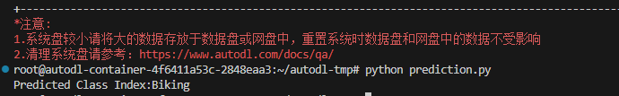

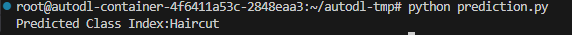

##### 2.使用GoogLeNet：

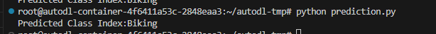

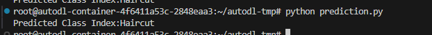

##### 3.使用自行实现的CNN：

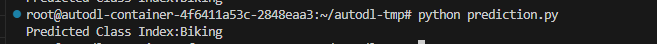

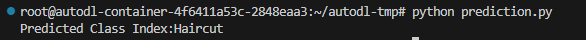

三种都对Biking和Haircut进行了成功预测，可见模型的准确性得到验证。

#### 五、参考文献
